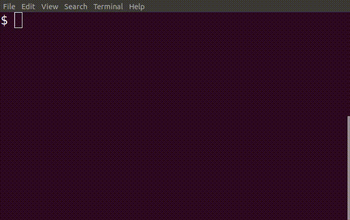
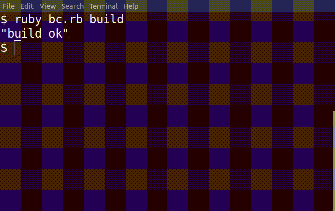
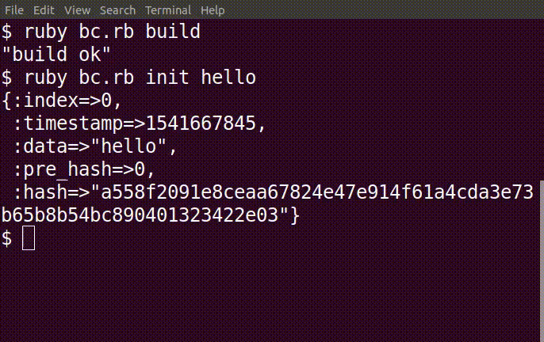
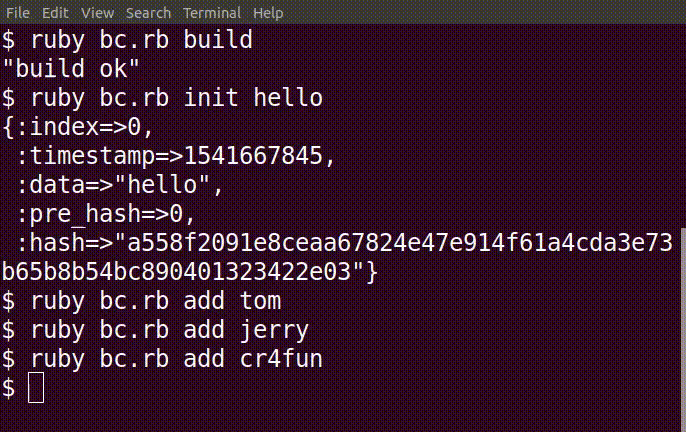
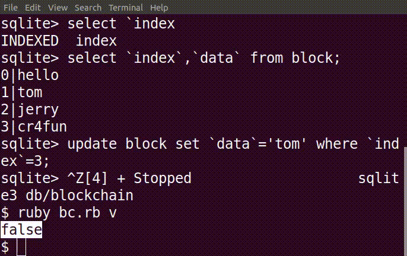

在 8 的基础上，增加了:

1. 高度

```
ruby bc.rb h
```

返回
```
1
```

2. 验证

```
ruby bc.rb v
```

```
true
```

这个时候，我们用数据库管理工具，去篡改一个数据。


```
ruby bc.rb v
```

```
false
```

说明数据不可篡改。


完整演示：

1. 创建数据库


2. 创建创世区块


3. 添加区块


4. 获得最后的区块


5. 获得全部的区块


6. 验证区块链


7. 篡改区块链，验证不通过


8. 改回篡改前的数据，验证通过

