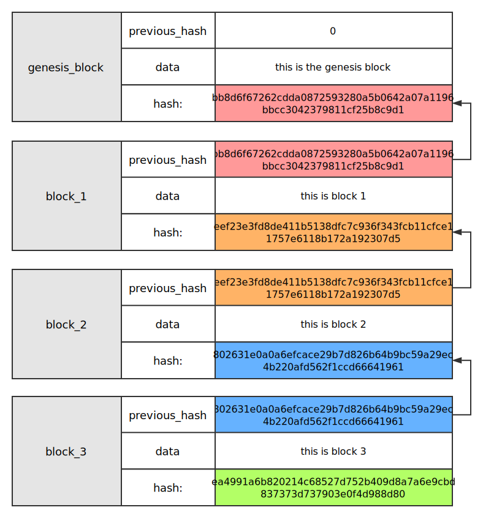
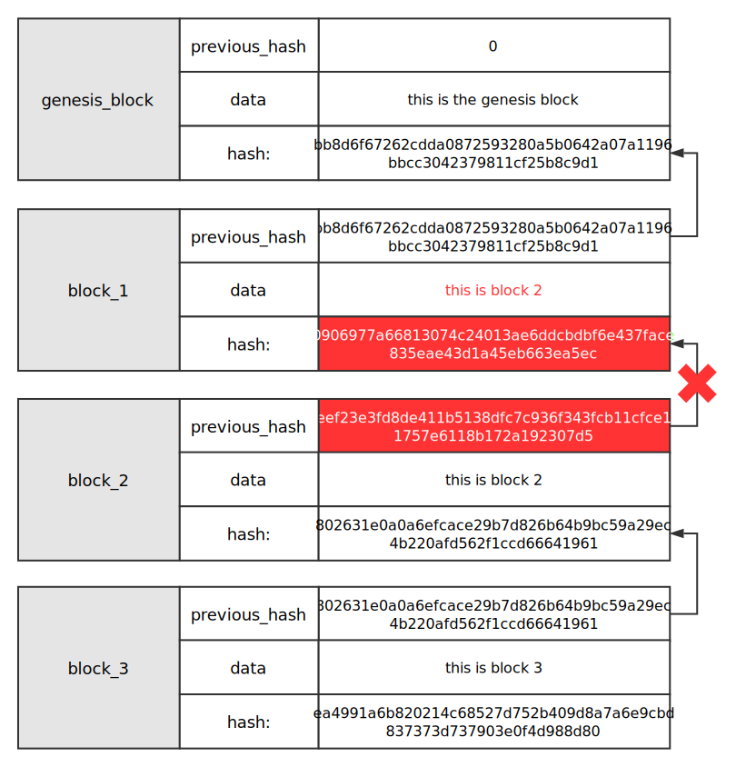
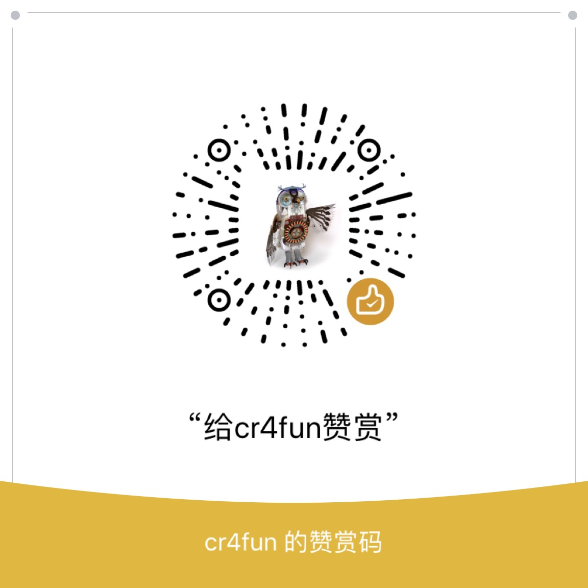

# 从零开始写区块链

介绍：这是一个教程，随着教程的更新，最终会打造一款对iot设备支持友好的区块链。

### 结构

目前大致结构是：

调用层：RPC
持久化：sqlite3 
物联网：MQTT

### 语言

本教程使用ruby开发。为什么不用其他语言，这里不做解释。

### 安装

```
gem install sqlite3
gem install xmlrpc
gem install sinatra
```

### 必要基础

区块链是一种由区块组成的链式结构。每个区块有自己唯一的hash值，也有上一个区块的hash值。区块一个一个链接，形成区块链。



如图所示，这是区块链中数据不可篡改的关键。假设把block_1的内容给篡改了，那么block_1的hash就变化了。结果导致block_2的previous_hash和block_1的hash对不上，因此这个区块链就断裂了。



### 如何学习？

每个数字目录（从1开始）下面都有代码和说明，按照说明实践即可。

### 教程

01）只有创世区块的区块链 [阅读](1/README.md)
02）得到卒后区块的哈希值 [阅读](2/README.md)
03）一个最小化完整区块链 [阅读](3/README.md)
04）带有验证功能的区块链 [阅读](4/README.md)
05）对代码进行优化和改进 [阅读](5/README.md)
06）使用sqlite3实现持久化 [阅读](6/README.md)
07）拆分成可用命令行操作 [阅读](7/README.md)
08）优化命令行操作 [阅读](8/README.md)
09）验证与篡改的演示 [阅读](9/README.md)
10）用RPC命令操作区块链 （未完成）

### bug 提交

只要有代码，就难免有bug。欢迎大家提交bug。

### 声明

本教程只用教学示例、教学研究，切不可用于商业及生产环境。否则一切后果自负！

### 知识星球

扫码加入知识星球，一起讨论区块链技术。


### 赞赏

如果我的课程对你有帮助，欢迎赞赏。赞赏的钱将用于出版纸质书籍。赞赏时请备注你的github帐号，我会罗列出来。

